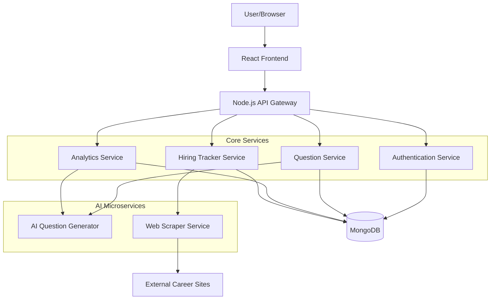

# AptiMaster AI - Multi-Branch Placement Prep System

## Project Overview
An AI-powered aptitude test preparation platform that provides company-specific aptitude questions, adaptive daily targets, hiring updates with auto-registration links, and personalized performance analytics. The system supports multiple engineering branches and their top companies.

## Core Features
1. **Multi-Branch Support**: Mechanical, Civil, Electrical, Electronics, IT
2. **Company-Specific Questions**: Top 5 companies per branch with tailored questions
3. **Adaptive Daily Target System**: Smart progression from 10 to 75 questions
4. **Campus Hiring Tracker**: Real-time hiring dates with apply links
5. **AI-Powered Features**: Question generation, weak area detection, recommendations
6. **Gamification**: Points, leaderboard, streaks
7. **Analytics Dashboard**: Performance graphs, accuracy, speed metrics

## Technology Stack

### Frontend
- **Framework**: React.js with TypeScript
- **UI Library**: Material-UI or Chakra UI
- **State Management**: Redux Toolkit or Zustand
- **Charts**: Recharts or Chart.js
- **Routing**: React Router v6

### Backend
- **Primary**: Node.js with Express.js
- **Authentication**: JWT with refresh tokens
- **API Documentation**: Swagger/OpenAPI
- **Validation**: Joi or Zod

### Database
- **Primary**: MongoDB Atlas (NoSQL)
- **ODM**: Mongoose
- **Caching**: Redis (optional for performance)

### AI Services
- **Framework**: Python with FastAPI
- **ML Libraries**: scikit-learn, transformers (for NLP)
- **Question Generation**: Rule-based + LLM integration
- **Deployment**: Separate microservice or integrated via REST

### DevOps & Deployment
- **Frontend Hosting**: Netlify or Vercel
- **Backend Hosting**: Render, Railway, or AWS Elastic Beanstalk
- **Database**: MongoDB Atlas
- **CI/CD**: GitHub Actions
- **Monitoring**: Sentry, LogRocket

## System Architecture



## Database Schema

### 1. Users Collection
```javascript
{
  _id: ObjectId,
  name: String,
  email: String,
  password: String, // hashed
  branch: String, // 'Mechanical', 'Civil', etc.
  profile_picture: String,
  streak: Number,
  total_points: Number,
  created_at: Date,
  last_login: Date
}
```

### 2. UserProgress Collection
```javascript
{
  _id: ObjectId,
  user_id: ObjectId,
  daily_targets: [{
    date: Date,
    target_questions: Number,
    completed_questions: Number,
    streak_maintained: Boolean
  }],
  weak_topics: [{
    topic: String,
    accuracy: Number,
    last_practiced: Date
  }],
  overall_stats: {
    total_questions_attempted: Number,
    average_accuracy: Number,
    average_time_per_question: Number
  }
}
```

### 3. Questions Collection
```javascript
{
  _id: ObjectId,
  question_text: String,
  options: [String],
  correct_answer: Number, // index
  explanation: String,
  trick: String,
  topic: String, // 'Profit & Loss', 'Time & Work', etc.
  branch: String, // 'Mechanical', 'Civil', etc.
  company: String, // 'Tata Motors', 'L&T', etc.
  difficulty: String, // 'easy', 'medium', 'hard'
  tags: [String],
  created_at: Date,
  ai_generated: Boolean
}
```

### 4. Companies Collection
```javascript
{
  _id: ObjectId,
  name: String,
  branch: String,
  description: String,
  logo_url: String,
  hiring_dates: [{
    role: String,
    date: Date,
    apply_link: String,
    status: String // 'upcoming', 'active', 'closed'
  }],
  question_count: Number
}
```

### 5. Attempts Collection
```javascript
{
  _id: ObjectId,
  user_id: ObjectId,
  session_id: String,
  questions: [{
    question_id: ObjectId,
    selected_option: Number,
    is_correct: Boolean,
    time_taken: Number // seconds
  }],
  score: Number,
  total_questions: Number,
  branch: String,
  company: String,
  completed_at: Date,
  time_taken_total: Number
}
```

### 6. DailyTargets Collection
```javascript
{
  _id: ObjectId,
  user_id: ObjectId,
  day_number: Number,
  target_questions: Number,
  completed_questions: Number,
  date: Date,
  status: String // 'pending', 'completed', 'failed'
}
```

## Frontend UI Structure

### Screen Flow
```
Landing Page → Login/Signup → Dashboard → Branch Selection → 
Company Selection → Practice Screen → Results → Analytics
```

### Key Screens
1. **Landing Page**: App intro, branch selection, "Start Practice"
2. **Dashboard**: Daily progress, weak topics, upcoming hiring, streak
3. **Branch Selection**: Cards for Mechanical, Civil, Electrical, Electronics, IT
4. **Company Selection**: Top 5 companies per branch with logos
5. **Practice Screen**: 
   - Question display with timer
   - Navigation panel for questions
   - Submit button (answers hidden during practice)
6. **Result Screen**:
   - Score and accuracy
   - Correct/incorrect breakdown
   - Solutions and tricks
   - Weak area suggestions
7. **Hiring Tracker**:
   - Company cards with dates
   - Apply buttons
   - Status indicators
   - "Add to Calendar" feature
8. **Profile Screen**:
   - Progress graphs
   - Applied companies
   - Settings and preferences

## Backend API Structure

### API Endpoints

#### Authentication
- `POST /api/auth/register` - User registration
- `POST /api/auth/login` - User login
- `POST /api/auth/refresh` - Refresh JWT token
- `POST /api/auth/logout` - User logout

#### User Management
- `GET /api/users/profile` - Get user profile
- `PUT /api/users/profile` - Update profile
- `GET /api/users/progress` - Get user progress
- `GET /api/users/streak` - Get streak information

#### Questions
- `GET /api/questions` - Get questions (with filters)
- `GET /api/questions/:id` - Get specific question
- `POST /api/questions/generate` - Generate AI question
- `GET /api/questions/topics` - Get available topics

#### Practice Sessions
- `POST /api/practice/start` - Start new practice session
- `POST /api/practice/submit` - Submit answers
- `GET /api/practice/history` - Get practice history

#### Companies
- `GET /api/companies` - Get all companies
- `GET /api/companies/:branch` - Get companies by branch
- `GET /api/companies/:id/hiring` - Get hiring dates

#### Hiring Tracker
- `GET /api/hiring/upcoming` - Get upcoming hiring
- `POST /api/hiring/notify` - Set notification preferences
- `GET /api/hiring/calendar` - Get calendar events

#### Analytics
- `GET /api/analytics/performance` - Get performance analytics
- `GET /api/analytics/weak-areas` - Get weak area analysis
- `GET /api/analytics/recommendations` - Get AI recommendations

## AI Features Design

### 1. Question Generator
- **Input**: Topic, difficulty, branch, company
- **Output**: New question with options and explanation
- **Approach**: 
  - Rule-based template filling for quantitative aptitude
  - LLM integration for verbal reasoning
  - Quality validation through similarity checking

### 2. Weak Area Detection
- **Algorithm**: Analyze incorrect answers and time taken
- **Output**: List of weak topics with confidence scores
- **Features**:
  - Topic clustering
  - Difficulty progression tracking
  - Personalized improvement suggestions

### 3. Recommendation System
- **Based on**: User performance, peer comparison, company requirements
- **Output**: Next practice topics, question sets, learning resources
- **Implementation**: Collaborative filtering + content-based filtering

### 4. Adaptive Difficulty
- **Logic**: Adjust question difficulty based on user performance
- **Implementation**: Bayesian knowledge tracing or Elo rating system

## Hiring Tracker System

### Data Sources
1. **Manual Entry**: Admin panel for adding companies
2. **Web Scraping**: Python scraper for career pages
3. **API Integration**: Job portals (Naukri, Indeed, LinkedIn)
4. **RSS Feeds**: Company career RSS feeds

### Update Mechanism
- **Cron Job**: Daily updates at 2 AM
- **Notification**: Email/push notifications for upcoming deadlines
- **Calendar Integration**: Google Calendar/Outlook sync

## Gamification System

### Points System
- Correct answer: +10 points
- Streak bonus: +5 points per consecutive day
- Speed bonus: +2 points for answering under 30 seconds
- Difficulty multiplier: Hard questions ×1.5 points

### Leaderboard
- Weekly and all-time rankings
- Branch-specific leaderboards
- Achievement badges

### Streak System
- Visual streak calendar
- Streak freeze (allow one missed day)
- Monthly challenges

## Development Roadmap

### Phase 1: Foundation (Weeks 1-2)
1. Set up project structure and repositories
2. Implement user authentication system
3. Create basic UI components and design system
4. Set up MongoDB database and connection
5. Deploy initial backend and frontend

### Phase 2: Core Features (Weeks 3-4)
1. Implement question management system
2. Build practice session flow
3. Create result and analytics screens
4. Implement basic daily target system
5. Add company and branch selection

### Phase 3: Advanced Features (Weeks 5-6)
1. Build hiring tracker with scraping
2. Implement notification system
3. Add gamification (points, leaderboard, streaks)
4. Create comprehensive analytics dashboard
5. Implement profile and settings

### Phase 4: AI Integration (Weeks 7-8)
1. Set up AI microservice
2. Implement question generator
3. Build weak area detection
4. Add recommendation system
5. Integrate adaptive difficulty

### Phase 5: Polish & Scale (Weeks 9-10)
1. Performance optimization
2. Responsive design improvements
3. Security enhancements
4. Load testing
5. Production deployment and monitoring

## Security Considerations
- JWT token rotation and short expiration
- Password hashing with bcrypt
- Rate limiting on API endpoints
- Input validation and sanitization
- CORS configuration for frontend
- HTTPS enforcement
- Regular security audits

## Scalability Considerations
- Database indexing on frequently queried fields
- Redis caching for question sets and user sessions
- CDN for static assets
- Load balancing for API servers
- Database connection pooling
- Asynchronous job processing for AI tasks

## Testing Strategy
- Unit tests for models and utilities
- Integration tests for API endpoints
- E2E tests for critical user flows
- Performance testing for question generation
- Security testing for authentication

## Deployment Architecture

```
Frontend (Netlify) → Backend (Render) → MongoDB Atlas
                    ↓
            AI Service (Railway)
                    ↓
            Scraper Service (PythonAnywhere)
```

## Success Metrics
- User engagement: Daily active users, session duration
- Learning outcomes: Accuracy improvement over time
- Completion rates: Daily target completion percentage
- User satisfaction: NPS scores, feature usage

## Future Enhancements
1. Mobile app (React Native)
2. Video explanations for solutions
3. Mock interview simulator
4. Peer comparison and study groups
5. Certification and badges
6. Integration with learning management systems

---

*This architecture provides a scalable foundation for AptiMaster AI that can evolve from an MVP to a full-featured placement preparation platform.*