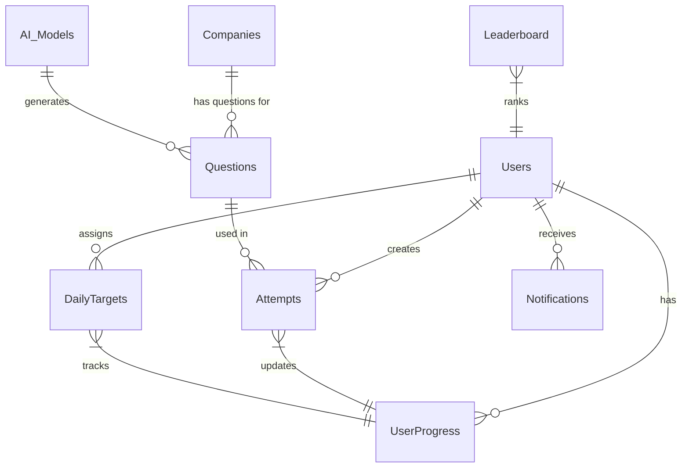

# AptiMaster AI - Database Schema Design

## Overview
This document details the complete MongoDB database schema for the AptiMaster AI platform, including collections, fields, data types, relationships, and indexing strategies.

## Collections

### 1. Users Collection
Stores user account information and basic profile data.

```javascript
{
  _id: ObjectId,                    // Primary key
  name: String,                     // User's full name
  email: String,                    // Unique email address
  password: String,                 // Hashed password (bcrypt)
  branch: String,                   // Engineering branch: 'Mechanical', 'Civil', 'Electrical', 'Electronics', 'IT'
  profile_picture: String,          // URL to profile image
  streak: Number,                   // Current consecutive days streak
  total_points: Number,             // Lifetime points earned
  level: Number,                    // User level based on points
  achievements: [String],           // Array of achievement badges
  settings: {
    notifications: Boolean,         // Email notifications preference
    daily_target: Number,           // Custom daily target (optional)
    theme: String                   // UI theme preference
  },
  created_at: Date,                 // Account creation timestamp
  last_login: Date,                 // Last login timestamp
  updated_at: Date                  // Last profile update timestamp
}
```

**Indexes:**
- `{ email: 1 }` (unique)
- `{ branch: 1 }`
- `{ created_at: -1 }`

### 2. UserProgress Collection
Tracks user learning progress, weak areas, and statistics.

```javascript
{
  _id: ObjectId,
  user_id: ObjectId,                // Reference to Users._id
  daily_targets: [{
    date: Date,                     // Target date
    target_questions: Number,       // Questions to attempt
    completed_questions: Number,    // Questions actually attempted
    streak_maintained: Boolean,     // Whether streak was maintained
    points_earned: Number           // Points earned that day
  }],
  weak_topics: [{
    topic: String,                  // Topic name (e.g., 'Profit & Loss')
    accuracy: Number,               // Accuracy percentage (0-100)
    last_practiced: Date,           // Last time topic was practiced
    question_count: Number,         // Total questions attempted
    correct_count: Number           // Correct answers count
  }],
  overall_stats: {
    total_questions_attempted: Number,
    total_correct_answers: Number,
    average_accuracy: Number,
    average_time_per_question: Number,  // in seconds
    total_practice_time: Number,        // in minutes
    days_active: Number
  },
  company_performance: [{
    company: String,                // Company name
    questions_attempted: Number,
    accuracy: Number,
    last_attempted: Date
  }],
  created_at: Date,
  updated_at: Date
}
```

**Indexes:**
- `{ user_id: 1 }` (unique)
- `{ "daily_targets.date": -1 }`
- `{ "weak_topics.accuracy": 1 }`

### 3. Questions Collection
Stores all aptitude questions with metadata.

```javascript
{
  _id: ObjectId,
  question_text: String,            // The question content
  question_type: String,            // 'quantitative', 'logical', 'verbal', 'technical'
  options: [String],                // Array of answer choices (4 options)
  correct_answer: Number,           // Index of correct option (0-3)
  explanation: String,              // Detailed solution explanation
  trick: String,                    // Shortcut or trick for solving
  topic: String,                    // Primary topic (e.g., 'Time & Work')
  subtopics: [String],              // Related subtopics
  branch: String,                   // Associated branch
  company: String,                  // Associated company
  difficulty: String,               // 'easy', 'medium', 'hard'
  tags: [String],                   // Additional tags for filtering
  time_estimate: Number,            // Estimated time to solve (seconds)
  source: String,                   // Source of question
  ai_generated: Boolean,            // Whether generated by AI
  quality_score: Number,            // Quality rating (1-5)
  usage_count: Number,              // How many times used
  correct_rate: Number,             // Percentage of users who got it right
  created_by: ObjectId,             // User/Admin who created
  created_at: Date,
  updated_at: Date
}
```

**Indexes:**
- `{ branch: 1, company: 1 }`
- `{ topic: 1, difficulty: 1 }`
- `{ tags: 1 }`
- `{ ai_generated: 1 }`
- `{ quality_score: -1 }`

### 4. Companies Collection
Stores company information and hiring details.

```javascript
{
  _id: ObjectId,
  name: String,                     // Company name
  branch: String,                   // Primary branch
  description: String,              // Company description
  logo_url: String,                 // Company logo URL
  website: String,                  // Company website
  hiring_dates: [{
    role: String,                   // Job role (e.g., 'Graduate Engineer')
    date: Date,                     // Hiring date
    apply_link: String,             // Application URL
    status: String,                 // 'upcoming', 'active', 'closed'
    location: String,               // Job location
    eligibility: [String],          // Eligibility criteria
    last_updated: Date              // When this info was updated
  }],
  question_count: Number,           // Number of questions available
  popularity: Number,               // How many users selected this company
  created_at: Date,
  updated_at: Date
}
```

**Indexes:**
- `{ name: 1 }` (unique)
- `{ branch: 1 }`
- `{ "hiring_dates.date": 1 }`
- `{ "hiring_dates.status": 1 }`

### 5. Attempts Collection
Records each practice session and user answers.

```javascript
{
  _id: ObjectId,
  user_id: ObjectId,                // Reference to Users._id
  session_id: String,               // Unique session identifier
  session_type: String,             // 'practice', 'test', 'mock'
  questions: [{
    question_id: ObjectId,          // Reference to Questions._id
    selected_option: Number,        // Option selected by user (0-3)
    is_correct: Boolean,            // Whether answer was correct
    time_taken: Number,             // Time spent (seconds)
    skipped: Boolean,               // Whether question was skipped
    confidence: Number              // User confidence rating (1-5)
  }],
  metadata: {
    branch: String,                 // Branch practiced
    company: String,                // Company focused (if any)
    topic: String,                  // Primary topic
    difficulty: String,             // Session difficulty
    question_count: Number          // Total questions in session
  },
  results: {
    score: Number,                  // Raw score
    percentage: Number,             // Percentage score
    total_correct: Number,          // Number of correct answers
    total_incorrect: Number,        // Number of incorrect answers
    total_skipped: Number,          // Number of skipped questions
    average_time: Number,           // Average time per question
    weak_topics: [String]           // Topics with poor performance
  },
  started_at: Date,
  completed_at: Date,
  time_taken_total: Number          // Total session time (seconds)
}
```

**Indexes:**
- `{ user_id: 1, completed_at: -1 }`
- `{ session_id: 1 }` (unique)
- `{ "metadata.branch": 1 }`
- `{ "metadata.company": 1 }`

### 6. DailyTargets Collection
Manages daily learning targets for users.

```javascript
{
  _id: ObjectId,
  user_id: ObjectId,                // Reference to Users._id
  day_number: Number,               // Day in the learning journey
  target_date: Date,                // Date for this target
  target_questions: Number,         // Questions to attempt
  completed_questions: Number,      // Questions actually attempted
  target_branches: [String],        // Branches to focus on
  target_companies: [String],       // Companies to focus on
  target_topics: [String],          // Topics to focus on
  status: String,                   // 'pending', 'in_progress', 'completed', 'failed'
  streak_affected: Boolean,         // Whether streak is affected by this day
  points_earned: Number,            // Points earned for this day
  completed_at: Date,               // When target was completed
  created_at: Date,
  updated_at: Date
}
```

**Indexes:**
- `{ user_id: 1, target_date: -1 }`
- `{ target_date: 1, status: 1 }`
- `{ user_id: 1, status: 1 }`

### 7. Leaderboard Collection
Stores leaderboard rankings for gamification.

```javascript
{
  _id: ObjectId,
  period: String,                   // 'daily', 'weekly', 'monthly', 'all_time'
  branch: String,                   // Branch-specific or 'all'
  rankings: [{
    user_id: ObjectId,              // Reference to Users._id
    rank: Number,                   // Current rank
    points: Number,                 // Points in this period
    accuracy: Number,               // Accuracy percentage
    questions_attempted: Number,    // Questions attempted
    streak: Number                  // Current streak
  }],
  calculated_at: Date,              // When rankings were calculated
  valid_until: Date,                // When rankings expire
  created_at: Date
}
```

**Indexes:**
- `{ period: 1, branch: 1, calculated_at: -1 }`
- `{ valid_until: 1 }`

### 8. Notifications Collection
Stores user notifications.

```javascript
{
  _id: ObjectId,
  user_id: ObjectId,                // Reference to Users._id
  type: String,                     // 'hiring', 'reminder', 'achievement', 'system'
  title: String,                    // Notification title
  message: String,                  // Notification message
  data: Object,                     // Additional data (company, link, etc.)
  read: Boolean,                    // Whether notification has been read
  sent_via: [String],               // Channels: 'email', 'push', 'in_app'
  scheduled_for: Date,              // When to send (for scheduled)
  sent_at: Date,                    // When actually sent
  created_at: Date
}
```

**Indexes:**
- `{ user_id: 1, read: 1, created_at: -1 }`
- `{ scheduled_for: 1, sent_at: 1 }`

### 9. AI_Models Collection
Tracks AI model versions and performance.

```javascript
{
  _id: ObjectId,
  model_name: String,               // e.g., 'question_generator_v1'
  version: String,                  // Model version
  purpose: String,                  // 'question_generation', 'difficulty_prediction', 'recommendation'
  performance: {
    accuracy: Number,
    precision: Number,
    recall: Number,
    f1_score: Number
  },
  training_data: {
    samples: Number,
    last_trained: Date
  },
  is_active: Boolean,               // Whether this model is active
  deployment_date: Date,
  created_at: Date
}
```

**Indexes:**
- `{ model_name: 1, version: 1 }` (unique)
- `{ is_active: 1 }`

## Relationships Diagram



## Data Validation Rules

### Users Collection
- Email must be unique and valid format
- Password must be at least 8 characters
- Branch must be one of: Mechanical, Civil, Electrical, Electronics, IT
- Streak cannot be negative

### Questions Collection
- Options array must have exactly 4 elements
- Correct_answer must be between 0 and 3
- Difficulty must be one of: easy, medium, hard
- Topic must be from predefined list

### Attempts Collection
- Time_taken must be positive number
- Selected_option must be between 0 and 3 or null if skipped
- Completed_at must be after started_at

## Indexing Strategy

### Primary Indexes
1. **Users**: `{ email: 1 }` (unique) for login lookups
2. **Questions**: `{ branch: 1, company: 1, difficulty: 1 }` for question retrieval
3. **Attempts**: `{ user_id: 1, completed_at: -1 }` for user history
4. **DailyTargets**: `{ user_id: 1, target_date: -1 }` for daily progress

### Secondary Indexes
1. **Compound indexes** for common query patterns:
   - `{ branch: 1, topic: 1, difficulty: 1 }` on Questions
   - `{ user_id: 1, "metadata.branch": 1, completed_at: -1 }` on Attempts
   - `{ period: 1, branch: 1, "rankings.points": -1 }` on Leaderboard

### Text Indexes
- `{ question_text: "text", explanation: "text" }` on Questions for search
- `{ name: "text", description: "text" }` on Companies for search

## Data Migration Considerations

### Versioning
- Each collection includes `schema_version` field for future migrations
- Backward compatibility maintained for at least 2 versions

### Archiving
- Old attempts (> 1 year) moved to archive collection
- Inactive users (> 6 months) flagged for cleanup

## Backup Strategy
- Daily automated backups to cloud storage
- Point-in-time recovery enabled
- Geographic redundancy for production data

## Performance Optimizations

### Query Optimization
- Use projection to limit returned fields
- Implement pagination for large result sets
- Use covered queries where possible

### Aggregation Pipeline
- Pre-aggregated statistics for dashboard
- Materialized views for complex reports
- Scheduled aggregation jobs for leaderboards

### Caching Layer
- Redis cache for frequently accessed:
  - User profiles
  - Question sets
  - Leaderboard rankings
  - Company hiring dates

---

*This schema is designed for scalability, performance, and maintainability while supporting all core features of AptiMaster AI.*