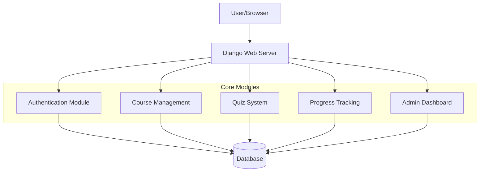

# Student Guide Project - Architecture Design

## Project Overview
A Python-based web application for managing student resources with user authentication, course materials, quizzes, progress tracking, and admin dashboard.

## Technology Stack
- **Backend Framework**: Django (Python)
- **Database**: SQLite (development), PostgreSQL (production)
- **Frontend**: Django Templates with Bootstrap 5
- **Authentication**: Django built-in authentication system
- **Additional Packages**:
  - Django REST Framework (optional API)
  - Django Crispy Forms (form styling)
  - Django Allauth (advanced authentication)
  - Pillow (image handling)

## System Architecture



## Database Schema

### Core Models
1. **User** (extends Django User)
   - profile_picture
   - bio
   - student_id
   - enrollment_date

2. **Course**
   - title
   - description
   - category
   - difficulty_level
   - created_date
   - instructor (ForeignKey to User)

3. **Module**
   - course (ForeignKey to Course)
   - title
   - order_number
   - content (HTML/text)

4. **Quiz**
   - module (ForeignKey to Module)
   - title
   - description
   - time_limit

5. **Question**
   - quiz (ForeignKey to Quiz)
   - question_text
   - question_type (multiple_choice, true_false, short_answer)
   - points

6. **Choice** (for multiple choice questions)
   - question (ForeignKey to Question)
   - choice_text
   - is_correct

7. **UserProgress**
   - user (ForeignKey to User)
   - module (ForeignKey to Module)
   - completion_status (completed, in_progress, not_started)
   - last_accessed
   - quiz_score

8. **UserQuizAttempt**
   - user (ForeignKey to User)
   - quiz (ForeignKey to Quiz)
   - score
   - completed_at
   - time_taken

## Application Structure

```
student_guide_project/
├── manage.py
├── requirements.txt
├── .env.example
├── .gitignore
├── README.md
├── student_guide/
│   ├── __init__.py
│   ├── settings.py
│   ├── urls.py
│   ├── wsgi.py
│   └── asgi.py
├── apps/
│   ├── accounts/           # User authentication & profiles
│   │   ├── models.py
│   │   ├── views.py
│   │   ├── urls.py
│   │   ├── forms.py
│   │   └── templates/
│   ├── courses/           # Course management
│   │   ├── models.py
│   │   ├── views.py
│   │   ├── urls.py
│   │   └── templates/
│   ├── quizzes/           # Quiz system
│   │   ├── models.py
│   │   ├── views.py
│   │   ├── urls.py
│   │   └── templates/
│   ├── progress/          # Progress tracking
│   │   ├── models.py
│   │   ├── views.py
│   │   ├── urls.py
│   │   └── templates/
│   └── dashboard/         # Admin & user dashboard
│       ├── models.py
│       ├── views.py
│       ├── urls.py
│       └── templates/
├── static/
│   ├── css/
│   ├── js/
│   └── images/
├── templates/
│   ├── base.html
│   ├── navigation.html
│   └── footer.html
├── media/                 # User uploaded files
└── tests/
```

## Feature Implementation Plan

### Phase 1: Foundation
1. Set up Django project and virtual environment
2. Configure database and basic settings
3. Create custom user model with extended fields
4. Implement user registration and authentication
5. Set up basic templates with Bootstrap

### Phase 2: Core Features
1. Course management system (CRUD operations)
2. Module/content management
3. Quiz creation and management
4. Question and choice management

### Phase 3: User Experience
1. Student enrollment in courses
2. Progress tracking system
3. Quiz taking functionality
4. Score calculation and results display

### Phase 4: Advanced Features
1. Admin dashboard with analytics
2. User progress reports
3. Search functionality
4. Notifications system
5. API endpoints (optional)

### Phase 5: Polish & Deployment
1. Responsive design improvements
2. Performance optimization
3. Security enhancements
4. Deployment configuration

## Security Considerations
- Password hashing with Django's built-in PBKDF2
- CSRF protection
- XSS prevention through template auto-escaping
- SQL injection prevention via Django ORM
- File upload validation
- Session security

## Scalability Considerations
- Database indexing on frequently queried fields
- Caching strategy for frequently accessed data
- CDN for static files in production
- Database connection pooling
- Asynchronous task handling for email notifications

## Testing Strategy
- Unit tests for models and business logic
- Integration tests for views and APIs
- Selenium tests for critical user flows
- Performance testing for database queries

## Deployment Options
1. **Platform as a Service**: Heroku, PythonAnywhere, Railway
2. **VPS**: DigitalOcean, AWS EC2, Linode
3. **Containerization**: Docker + Docker Compose
4. **Serverless**: AWS Lambda + API Gateway (with Zappa)

This architecture provides a solid foundation for a scalable, maintainable student guide application that can grow with user needs.